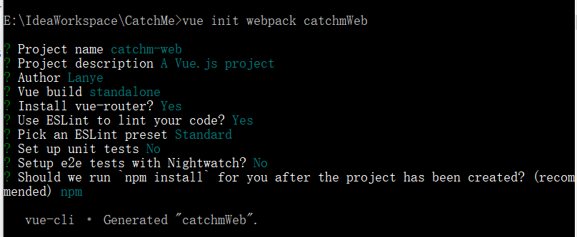

# SBS - Spring Boot Start
- If you are building a SB project for the first time, you will like it~!!

### ※ W

	Spring Boot is designed to get you up and running as quickly as possible, with minimal upfront configuration of Spring. Spring Boot takes an opinionated view of building production-ready applications.
	
	This document is only for beginners who don't struggle with project structure that very unrealistic. T.T


### ※ B

	IDE: it's up to you.
	JDK: 1.8+ (It could be lower?)
	maven: 3.5.3 (You know what I mean...)


##### One. Make the project structure.

- org.apache.maven.archetypes:maven-archetype-quickstart

```
＋ parent
  - api             // save the controller.
  - core            // entity and connect the database.
  - dao             // they like core.
  - service         // I'm omnipotent!?
  - tools           // I'm ..emmm. Do you like to use me or not.
  + web             // vue web.
```

~~If you don't like it? A.. you can go!!! I let you go!!!~~

- In order to understand the spring boot setup more clearly, I will just use the mvn to build a init at first. It's mean that we will depend the dependencies by ourselves.

##### ◆ API

- At first, API need to depend two self-defined modules;

```xml
<dependencies>
  <dependency>
    <groupId>com.lanye.cm</groupId>
    <artifactId>catchm-service</artifactId>
    <version>1.0.0-SNAPSHOT</version>
  </dependency>
  <dependency>
    <groupId>com.lanye.cm</groupId>
    <artifactId>catchm-tool</artifactId>
    <version>1.0.0-SNAPSHOT</version>
  </dependency>
</dependencies>
```
- spring boot's dependencies:


##### ◆ CORE


##### ◆ DAO


##### ◆ SERVICE


##### ◆ TOOL


##### ◆ WEB

- Vue init webpack web-name

```
	prepare:
		npm
		Node.js
		vue-cli
```



